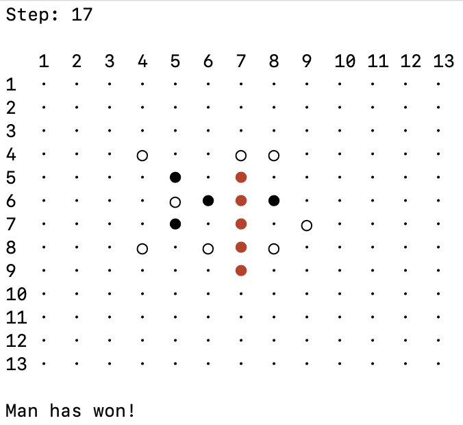

## Portfolio

---

[Gomoku](https://github.com/Thomas-Gao-MIDS/Gomoku), Fall 2020

This project has been identified as one of the best in my semester (top <5%) and included into public-facing showcase.

The Gomoku project is written as part of MIDS Python course with the objective to demonstrate understanding of OOP. In this little program, users can choose to play against each other, play against a bot, or have two bots play against each other. Bots follow a set of pre-defined rules in the Strategy class. The set of rules can be expanded, and in future perhaps code can be used to train bots through adverserial learning. 

Page template forked from <a href="https://github.com/evanca/quick-portfolio">evanca</a>

<!-- Remove above link if you don't want to attibute -->
